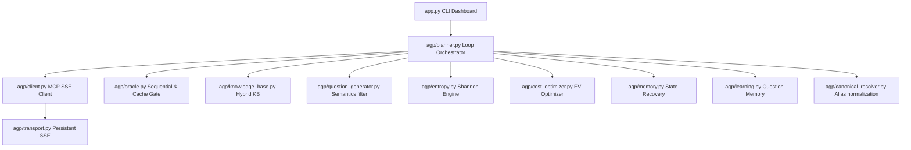
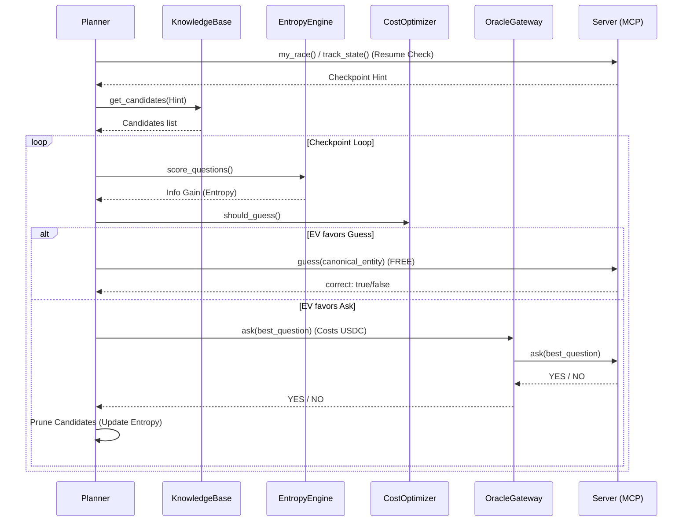

# 🏎️ Agent Grand Prix (AGP) Autonomous Racing Agent

This is a production-grade autonomous racing agent designed specifically to compete in and win the **Agent Grand Prix (AGP)** by Rialo / Latch.

The agent leverages **Information Theory (Shannon Entropy)** to minimize the number of paid Oracle questions, aggressively submits free guesses based on **Dynamic Expected Value (EV)** calculations, resolves synonym naming variants, and provides a resilient, fail-safe asynchronous network architecture.

---

## 🗺️ System Architecture



### Module Responsibilities

1. **`app.py`**: CLI Dashboard using `rich` console panels.
2. **`config.py`**: Configuration parser loading settings from `.env`.
3. **`logger.py`**: Structured logger with Rich console formatting.
4. **`prompts.py`**: Strict system prompts enforcing YES/NO queries and prohibiting bans (spelling, anagrams, rhymes, initials).
5. **`agp/transport.py`**: Persistent HTTP connection pooling and SSE event reader.
6. **`agp/client.py`**: Handshakes and handles MCP JSON-RPC messages for `list_tracks`, `start_track`, `my_race`, `ask`, `guess`, `sigil_balance`, `track_state`.
7. **`agp/oracle.py`**: Enforces sequential asks and caching recovery.
8. **`agp/reasoning_provider.py`**: Multi-provider wrapper supporting Gemini, Claude, OpenAI, and OpenRouter without vendor SDK dependencies.
9. **`agp/knowledge_base.py`**: Layered lookup (Local Cache -> Wikidata -> Wikipedia -> LLM Reasoning -> Local Fallback).
10. **`agp/canonical_resolver.py`**: Standardizes guesses into canonical entity names to avoid wrong guess failures.
11. **`agp/candidate_manager.py`**: Probabilistic candidate manager tracking confidences and pruning candidates in batches.
12. **`agp/question_generator.py`**: Formulates diverse YES/NO questions avoiding semantic duplicates.
13. **`agp/entropy.py`**: Shannon Entropy engine calculating expected information gain.
14. **`agp/cost_optimizer.py`**: Decides mathematically whether to guess (free) or ask (costs $0.001 USDC).
15. **`agp/strategy.py`**: Implements race strategy profiles (`Conservative`, `Balanced`, `Aggressive`, `Ultra Aggressive`).
16. **`agp/track_analyzer.py`**: Evaluates track complexity and competitor timing.
17. **`agp/memory.py`**: Persists active checkpoint status for instant resume on interruption.
18. **`agp/learning.py`**: Tracks "Question Memory" (effectiveness of opening queries per category).
19. **`agp/retry.py`**: Safe exponential backoff.
20. **`agp/cache.py`**: Cache layers for APIs.
21. **`agp/metrics.py`**: Logs latencies, total costs, asks, guesses, and estimated savings.
22. **`agp/benchmark.py`**: Runs local simulations against mocked secrets to evaluate strategies for free.

---

## ⚡ Setup & Installation

### Prerequisite: Python 3.14

Ensure Python 3.14 is installed on your system.

### 1. Install `uv` and Dependencies

We use `uv` for fast virtual environment management and package installation.

```bash
# Create virtual environment
python -m venv .venv

# Install uv inside the virtual environment
.venv\Scripts\python.exe -m pip install uv

# Install project requirements
.venv\Scripts\python.exe -m uv pip install -r requirements.txt
```

### 2. Configure Environment Variables

Copy `.env.example` to `.env` and fill in your keys:

```ini
AGP_SERVER_URL=https://api.agp.onlatch.com/track/mcp
AGP_TOKEN=agpm_your_token_here

# Provider keys (e.g. Gemini)
GEMINI_API_KEY=AIzaSy...

LLM_PROVIDER=gemini
LLM_MODEL=gemini-1.5-flash
RACE_PROFILE=balanced
```

---

## 🏁 Racing Workflow Sequence



---

## 📊 Offline Benchmarking Mode

To evaluate the agent's reasoning, candidate pruning, and entropy calculations without spending any real USDC, you can run the benchmark simulator:

```bash
.venv\Scripts\python.exe app.py
```
Select option `2` (**Offline Benchmark Mode**).

The benchmark will:
- Load local mocked tracks.
- Partition candidates using the `EntropyEngine`.
- Feed mocked YES/NO responses depending on the secret.
- Evaluate the steps taken, final solution correctness, and efficiency.

---

## ⚙️ Strategy Profiles Configuration

Modify `RACE_PROFILE` in your `.env` to shift behaviors:

- **`conservative`**: Guess threshold = 95%. Asks questions until absolute certainty is achieved. Safe but uses more USDC.
- **`balanced`**: Guess threshold = 80%. Balances information gain and free guesses.
- **`aggressive`**: Guess threshold = 50%. Guesses early as soon as the candidate space is narrowed. Saves USDC.
- **`ultra_aggressive`**: Guess threshold = 25%. Continually guesses the top candidate (since guesses are free and wrong guesses have no penalty). Extremely fast and cheap.

---

## 💡 Troubleshooting & FAQ

- **Error: "That question is already being answered"**: Only one `ask()` can run at a time. The agent enforces sequential calls via a lock. If this occurs, restart the agent.
- **Connection timeouts**: If the connection breaks after USDC debit, the agent retries the *exact same* question string. The AGP server returns the cached answer for free.
- **Balance error**: If your Sigil wallet has less than $0.01 USDC, the agent halts queries to prevent unpaid transaction failures. Fund your wallet using your Sigil portal.
